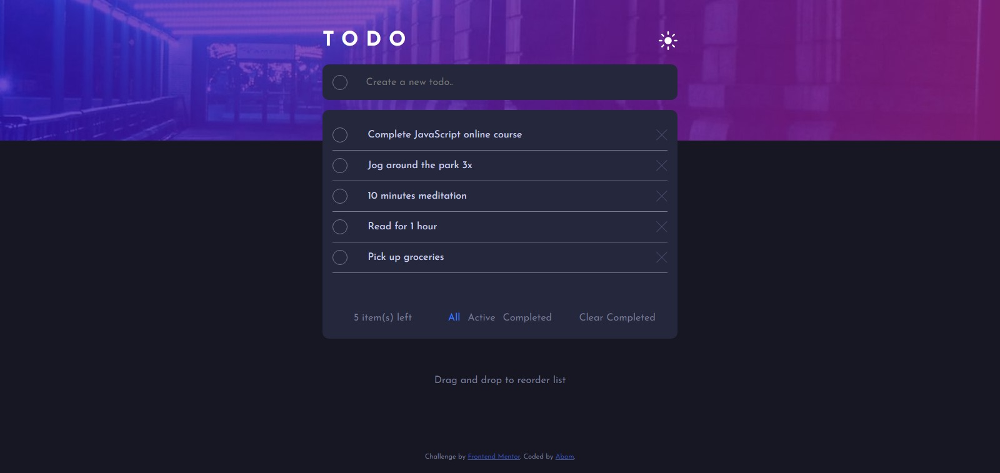

# Frontend Mentor - Todo app solution

This is a solution to the [Todo app challenge on Frontend Mentor](https://www.frontendmentor.io/challenges/todo-app-Su1_KokOW). Frontend Mentor challenges help you improve your coding skills by building realistic projects.

## Table of contents

- [Overview](#overview)
  - [The challenge](#the-challenge)
  - [Screenshot](#screenshot)
  - [Links](#links)
- [My process](#my-process)
  - [Built with](#built-with)
  - [What I learned](#what-i-learned)
  - [Continued development](#continued-development)
  - [Useful resources](#useful-resources)
- [Author](#author)
- [Acknowledgments](#acknowledgments)

## Overview

### The challenge

Users should be able to:

- View the optimal layout for the app depending on their device's screen size
- See hover states for all interactive elements on the page
- Add new todos to the list
- Mark todos as complete
- Delete todos from the list
- Filter by all/active/complete todos
- Clear all completed todos
- Toggle light and dark mode
- **Bonus**: Drag and drop to reorder items on the list

### Screenshot

### Links

- Solution URL: [Solution](https://www.frontendmentor.io/solutions/todo-app-built-with-vanilla-javascript-cspRiegKs)
- Live Site URL: [Live site](https://todo-app-main-tau.vercel.app/)

## My process

### Built with

- Semantic HTML5 markup
- CSS custom properties
- Flexbox
- CSS Grid
- Mobile-first workflow
- Vanilla JavaScript

### What I learned

This challenge is so much fun to do and gave me a lot of new knowledge about what JavaScript can do, such as theme changing from dark theme to light theme and of course the drag and drop feature.

### Continued development

The fact that i still can't find a way to store the task to local storage and get them back still bothering me. So, in the future i would like to learn how to do that.

### Useful resources

- [Web Dev Simplified - Youtube](https://youtu.be/jfYWwQrtzzY) - Thanks to Web Dev simplified for the drag and drop explanation.

## Author

- Website - [Abam](https://zulfaabam.github.io/my-portfolio-website/)
- Frontend Mentor - [@Zulfaabam](https://www.frontendmentor.io/profile/Zulfaabam)
- Twitter - [@zabamz1](https://www.twitter.com/zabamz1)

## Acknowledgments

-
